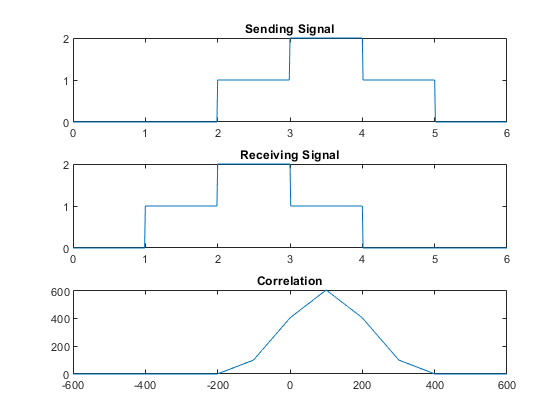
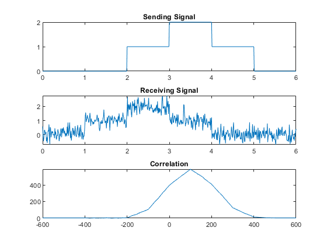

**Experiment No.:** 04

**Experiment Name:** Signal identification by using correlation

**Experiment Date:** 15.05.2023

**Theory:** In general, correlation describes the mutual relationship which exists between two or more things. The same definition holds good even in the case of signals. That is, correlation between signals indicates the measure up to which the given signal resembles another signal.

In other words, if we want to know how much similarity exists between the signals 1 and 2, then we need to find out the correlation of Signal 1 with respect to Signal 2 or vice versa.

Depending on whether the signals considered for correlation are same or different, we have two kinds of correlation: autocorrelation and cross-correlation.

Let us assume that a signal sent is sent from a transmitter. The signal arrives at the receiver after being delayed by an unknown interval of time.

Now, suppose that we need to find this delay, which is a result of being transmitted over the communication channel. This objective can be achieved by cross-correlating the signal sent with the signal received. If the correlation value is maximum at t=a, This means that the received signal matches with the test signal the best when the test signal is shifted by 10 units along the time-axis.

**Code:**

**Without Noise:**

```
clc;
clear all;
t = 0:0.01:6;
 
s1 = t>=2 & t<=5;
s2 = t>=3 & t<=4;
s = s1+s2;
 
d1 = t>=1 & t<=4;
d2 = t>=2 & t<=3;
d = d1+d2;
 
R = xcorr(s,d);
 
L = length(t)-1;
A = -L:L;
 
subplot(311);
plot(t,s);
title("Sending Signal");
 
subplot(312);
plot(t,d);
title("Receiving Signal");
 
subplot(313);
plot(A,R);
title("Correlation");
 
max = max(R);
i = find(R == max);
 
index = i-L
```

**With Noise:**
```
clc;
clear all;
 
t = 0:0.01:6;
 
s1 = t>=2 & t<=5;
s2 = t>=3 & t<=4;
s = s1+s2;
 
d1 = t>=1 & t<=4;
d2 = t>=2 & t<=3;
d = d1+d2;
 
n = awgn(d,10);
 
R = xcorr(s,n);
 
L = length(t)-1;
A = -L:L;
 
subplot(311);
plot(t,s);
title("Sending Signal");

subplot(312);
plot(t,n);
title("Receiving Signal");
 
subplot(313);
plot(A,R);
title("Correlation");
 
max = max(R);
i = find(R == max);
 
index = i-L
```

**Input Output:**



**Fig. 1:** Without Noise Correlation of Sending Signal and Received Signal



**Fig. 2:** With Noise Correlation of Sending Signal and Received Signal

**Discussion & Conclusion:** In this Experiment, we calculated the delay of a signal by using Correlation. And the result is matched with the theories.


